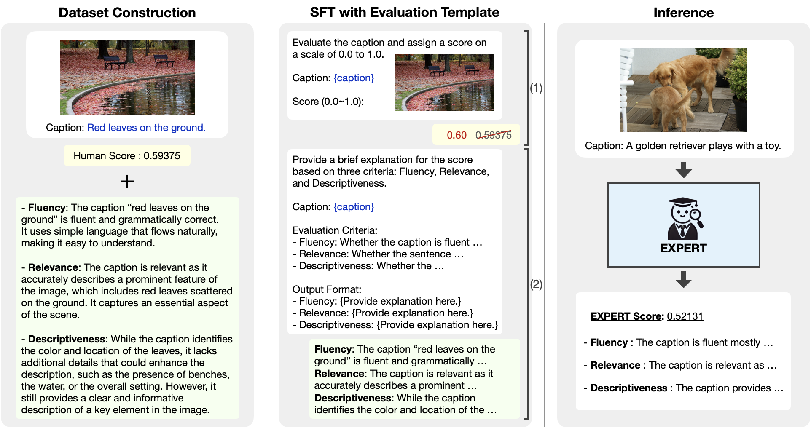
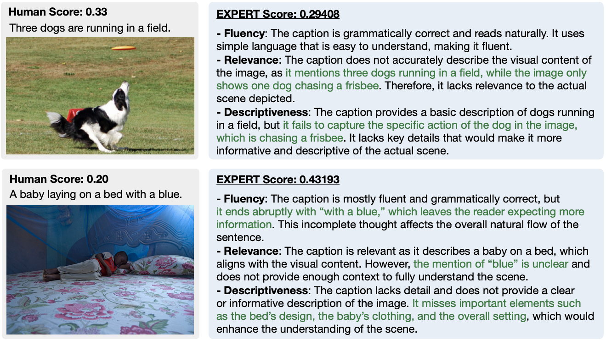

# 🔍 EXPERT: An Explainable Image Captioning Evaluation Metric with Structured Explanations

EXPERT is a reference-free evaluation metric for image captioning that provides structured explanations. Given an image and a caption, EXPERT generates a score and an explanation based on fluency, relevance, and descriptiveness.

<p align="center">
  
</p>

## Explanation Datasets
`Polaris-exp` and `Nebula-exp` datasets are available in the `exp_datasets/` directory. `Polaris-exp` and `Nebula-exp` are extended versions of [Polaris](https://huggingface.co/datasets/yuwd/Polaris) and [Nebula](https://huggingface.co/datasets/Ka2ukiMatsuda/Nebula),
with an **explanation** added to each image-caption pair.
Each explanation is structured according to three dimensions: **fluency**, **relevance**, and **descriptiveness**.
These datasets are used for training EXPERT.
`Polaris-exp` is released under the [Clear BSD License](https://github.com/hjkim811/EXPERT/blob/main/exp_datasets/LICENSE), following the [license](https://github.com/keio-smilab24/Polos/blob/master/LICENSE) of the original Polaris dataset.

## Environment Setup
Please follow the instructions in the [LLaVA repository](https://github.com/haotian-liu/LLaVA?tab=readme-ov-file#install) to install the requirements.

## Download Images
To run EXPERT on benchmark datasets, please download the images and place them in the following directories:
- `images/Flickr8k_Dataset`: Download from this [link](https://www.kaggle.com/datasets/adityajn105/flickr8k).
- `images/Flickr30k_Dataset`: Download from this [link](https://www.kaggle.com/datasets/hsankesara/flickr-image-dataset).
- `images/Polaris`: Download from this [link](https://github.com/keio-smilab24/Polos?tab=readme-ov-file#datasets).
- `images/Nebula`: Download from this [link](https://github.com/Ka2ukiMatsuda/DENEB?tab=readme-ov-file#dataset).
- `images/VOC2012`: Download from this [link](http://host.robots.ox.ac.uk/pascal/VOC/voc2012/#devkit).
- `images/val2014`: Download by running `wget http://images.cocodataset.org/zips/val2014.zip`.

## Usage
Use the following commands to run EXPERT:
```bash
# For scores only
python expert.py --input_json flickr8k.json

# For scores and explanations
python expert.py --input_json flickr8k.json --explanation True
```

To print logs, add the `--print_logs` flag:
```bash
# For scores only
python expert.py --input_json flickr8k.json --print_logs

# For scores and explanations
python expert.py --input_json flickr8k.json --explanation True --print_logs
```

To run EXPERT on other datasets:
```bash
python expert.py --input_json flickr8k.json                          # Flickr8k-EX
python expert.py --input_json crowdflower_flickr8k.json              # Flickr8k-CF
python expert.py --input_json composite.json                         # COMPOSITE
python expert.py --input_json polaris_test.json                      # Polaris
python expert.py --input_json nebula_test.json                       # Nebula
python expert.py --input_json pascal_50s.json --pascal_category HC   # Pascal-50S (HC, HI, HM, MM)
```

## Examples
<p align="center">
  
</p>
